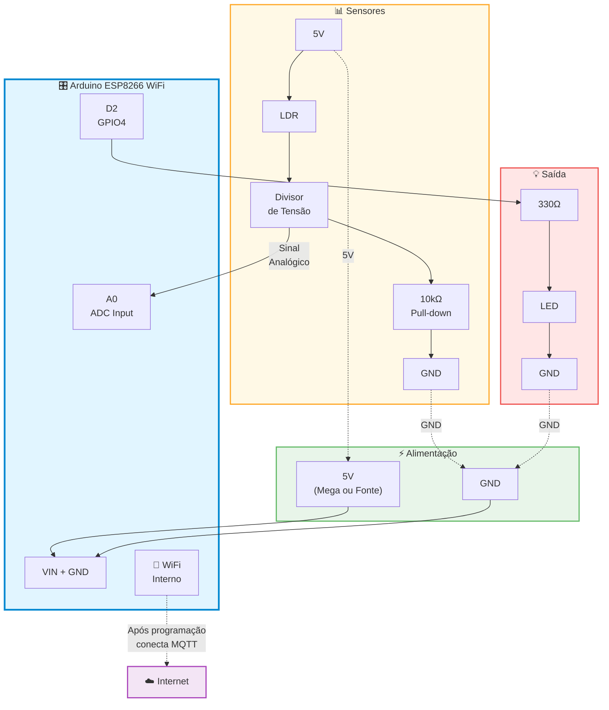
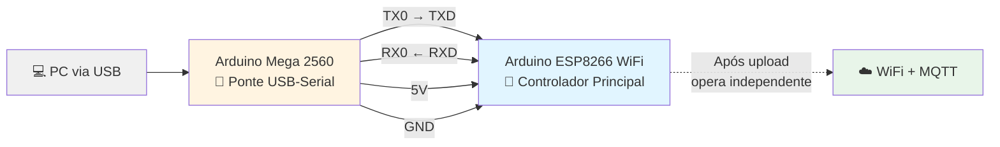
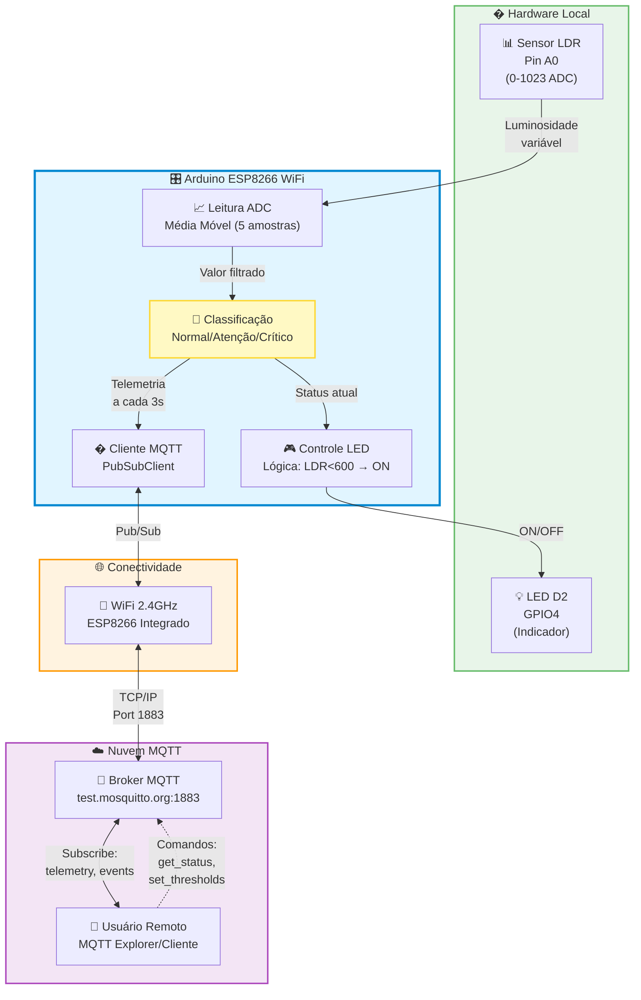
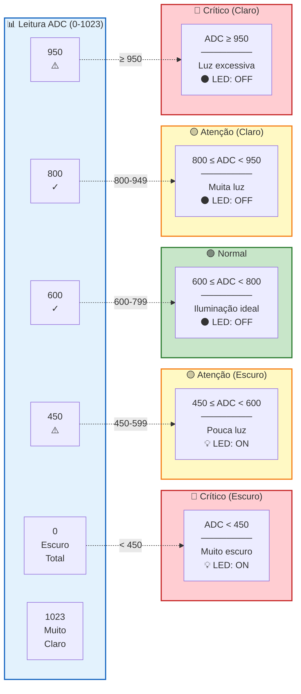
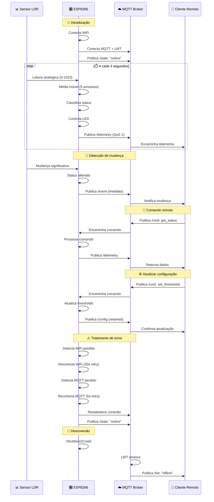
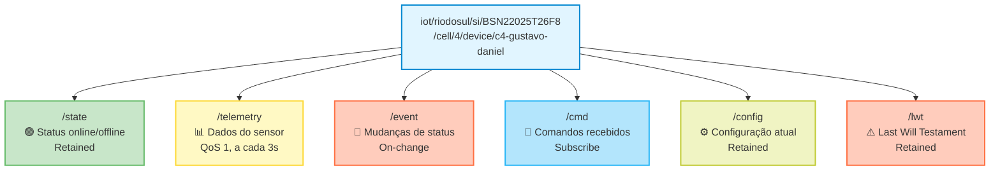
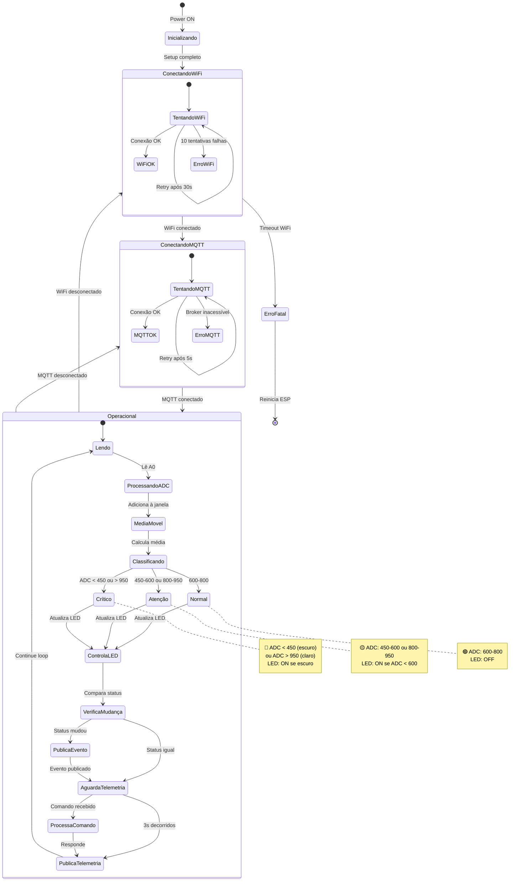

# 🌐 Sistema IoT - Monitoramento com MQTT

Sistema de monitoramento de luminosidade com ESP8266, sensor LDR e publicação de dados via protocolo MQTT.

---

## 📋 Visão Geral

Este projeto implementa um **sensor IoT inteligente** que:

1. 🌡️ Monitora luminosidade ambiente via sensor LDR
2. 📊 Classifica o ambiente em 3 níveis: **normal**, **atenção** ou **crítico**
3. 💡 Controla LED automaticamente baseado no status
4. 📡 Publica telemetria via MQTT a cada 3 segundos
5. 🔄 Detecta mudanças e publica eventos on-change
6. 💬 Recebe comandos remotos via MQTT

---

## 🔧 Ambientes Disponíveis

### **ESP8266** (Principal - Sistema IoT Completo)

Sistema completo com WiFi e MQTT para monitoramento remoto.

```bash
# Compilar
pio run -e esp8266

# Upload no ESP8266
pio run -e esp8266 -t upload

# Monitor Serial
pio device monitor -e esp8266
```

**Componentes necessários:**
- 1x **Arduino ESP8266 WiFi** (placa compatível com UNO)
- 1x Arduino Mega 2560 (apenas para programação via USB)
- 1x Sensor LDR (Light Dependent Resistor)
- 1x Resistor 10kΩ (pull-down do LDR)
- 1x LED externo
- 1x Resistor 330Ω (para o LED)
- Jumpers para conexão Mega ↔ ESP8266
- Protoboard
- Cabo USB para programação

**Funcionalidades:**
- ✅ Conexão WiFi automática
- ✅ Publicação MQTT em broker público
- ✅ Telemetria JSON a cada 3 segundos
- ✅ Publicação instantânea ao detectar mudança de status
- ✅ Recebe comandos: `get_status`, `set_thresholds`
- ✅ Last Will Testament (LWT) para detectar desconexão
- ✅ Reconexão automática WiFi e MQTT
- ✅ Média móvel (5 amostras) para estabilidade
- ✅ 3 níveis de classificação com thresholds ajustáveis

---

### **Arduino Mega** (Ambiente de Testes)

Firmware em branco para testes e experimentação.

```bash
# Compilar e upload
pio run -e mega -t upload
```

**Uso:** Template vazio para desenvolver e testar código no Arduino Mega 2560.

---

## 🔌 Diagrama de Conexões

### **Arduino ESP8266 WiFi - Conexões dos Sensores**

O Arduino Mega serve apenas como **ponte USB-Serial** para programação. Todos os sensores e atuadores conectam diretamente no **Arduino ESP8266 WiFi**.



### **Programação via Arduino Mega (Passthrough USB)**



**⚠️ Importante:** Pinagem direta (TX→TXD, RX→RXD) - Após programação, o ESP8266 opera independentemente.

### **Detalhes dos Circuitos**

#### **Circuito LDR (Sensor de Luminosidade)**

```
5V ──────┬─────[ LDR ]─────┬───────● A0 (ESP8266 WiFi)
         │                 │
         │              [ 10kΩ ]
         │                 │
         │                 └───────● GND
```

**Funcionamento:**
- **Muita luz**: LDR ~1kΩ → V_A0 alta → ADC ~800-1023
- **Pouca luz**: LDR ~100kΩ → V_A0 baixa → ADC ~0-200
- ⚠️ ESP8266 usa ADC 10-bit (0-1023) igual Arduino UNO

#### **Circuito LED (Indicador Visual)**

```
D2 ───[ 330Ω ]────┬───● LED (+) Anodo
(GPIO4)           │
                  └───● LED (-) Catodo ─── GND
```

**Controle automático:**
- LDR < 600 (pouca luz) → **LED ON** 💡
- LDR > 600 (muita luz) → **LED OFF** ⚫

### **Tabela de Conexões**

#### **Sensores e Atuadores → Arduino ESP8266 WiFi**

| Componente | Pino ESP8266 | Observações |
|------------|--------------|-------------|
| **LDR** (terminal 1) | 5V | Alimentação positiva |
| **LDR** (terminal 2) | A0 | Entrada analógica (0-1023) |
| **Resistor 10kΩ** | A0 ↔ GND | Pull-down do LDR |
| **LED** (anodo +) | D2 (GPIO4) | Via resistor 330Ω |
| **LED** (catodo -) | GND | Terra comum |

#### **Programação (Arduino Mega como ponte USB)**

| Mega 2560 | ESP8266 WiFi | Função |
|-----------|--------------|--------|
| USB | - | Conexão com PC |
| TX0 (Pin 1) | TXD | ⚠️ Pinagem direta |
| RX0 (Pin 0) | RXD | ⚠️ Pinagem direta |
| 5V | VIN | Alimentação |
| GND | GND | Terra comum |

**Nota:** Mega serve apenas para programação. Após upload, ESP8266 opera independentemente.

#### **Pinagem Arduino ESP8266 WiFi (Compatível com UNO)**

| Pino | Tipo | Função no Projeto | Observação |
|------|------|-------------------|------------|
| **A0** | Analógico | Sensor LDR | ADC 10-bit (0-1023) |
| **D2** | Digital | LED externo | GPIO4 |
| **TXD** | Serial | Recebe do Mega | ⚠️ Pinagem invertida |
| **RXD** | Serial | Envia ao Mega | ⚠️ Pinagem invertida |
| **VIN** | Power | Alimentação 5V | Do Arduino Mega |
| **3V3** | Power | Saída 3.3V | Regulador interno |
| **GND** | Ground | Terra | Comum com Mega |
| **D0-D12** | Digital | Livres | Expansão futura |
| **WiFi** | Interno | MQTT/WiFi | ESP8266 integrado |

### **Arquitetura do Sistema**



### **Classificação de Status por Thresholds**



**Lógica de Controle do LED:**
- 🔴 **Crítico/Atenção (escuro)**: LDR < 600 → LED **ON** 💡
- 🟢 **Normal/Atenção/Crítico (claro)**: LDR ≥ 600 → LED **OFF** ⚫

### **Fluxo de Dados MQTT**



### **Pinos Utilizados**

#### **Arduino ESP8266 WiFi** (Placa principal)

```
┌─────────────────────────────────────────────────┐
│  Pino    │  Tipo   │   Função                  │
├──────────┼─────────┼───────────────────────────┤
│  A0      │ Analog  │ Sensor LDR (0-1023)       │
│  D2      │ Digital │ LED (GPIO4)               │
│  TXD     │ Serial  │ Upload via Mega           │
│  RXD     │ Serial  │ Upload via Mega           │
│  VIN     │ Power   │ 5V (do Mega/fonte)        │
│  GND     │ Ground  │ Terra comum               │
│  WiFi    │ Interno │ Conecta MQTT              │
└─────────────────────────────────────────────────┘
```

#### **Arduino Mega 2560** (Ponte USB apenas)

```
┌─────────────────────────────────────────────────┐
│  Pino    │  Tipo   │   Função                  │
├──────────┼─────────┼───────────────────────────┤
│  USB     │ Serial  │ Conexão com PC            │
│  TX0 (1) │ Serial  │ Envia para ESP8266        │
│  RX0 (0) │ Serial  │ Recebe do ESP8266         │
│  5V      │ Power   │ Alimenta ESP8266          │
│  GND     │ Ground  │ Terra comum               │
└─────────────────────────────────────────────────┘

Nota: Mega serve apenas para programação
```

### **Valores Típicos do LDR (Arduino ESP8266 WiFi)**

| Condição | Resistência LDR | Tensão A0 | ADC (0-1023) | Status |
|----------|-----------------|-----------|--------------|--------|
| Escuro total | ~100kΩ | ~0.3V | 0-450 | **Crítico** |
| Penumbra | ~10kΩ | ~1.0V | 450-600 | **Atenção** |
| Normal | ~5kΩ | ~1.5V | 600-800 | **Normal** |
| Iluminado | ~2kΩ | ~2.5V | 800-950 | **Atenção** |
| Muito claro | ~1kΩ | ~3.0V | 950-1023 | **Crítico** |

⚠️ **Nota:** Arduino ESP8266 WiFi usa ADC de 10-bit (0-1023) compatível com Arduino UNO.

---

## ⚙️ Configuração do Sistema

### **1. Criar Arquivo de Configuração**

**Primeira vez configurando o projeto:**

```bash
# 1. Copie o template de configuração
cp include/config.h.template include/config.h

# 2. Edite include/config.h com suas credenciais
```

**Edite `include/config.h` e configure:**

```cpp
// ============ CONFIGURAÇÃO WiFi ============
const char *WIFI_SSID = "SuaRede";          // Nome da rede WiFi
const char *WIFI_PASSWORD = "SuaSenha";     // Senha do WiFi

// ============ CONFIGURAÇÃO MQTT ============
const char *MQTT_BROKER = "test.mosquitto.org";  // Broker público
const int MQTT_PORT = 1883;                      // Porta padrão

// ============ IDENTIFICAÇÃO ============
const char *DEVICE_ID = "c4-seu-nome";      // Seu nome/ID único
```

⚠️ **Importante:** O arquivo `config.h` contém credenciais e **não será commitado** no Git (está no `.gitignore`).

### **2. Ajustar Nível de Debug (Opcional)**

Em `src/main_esp8266_mqtt.cpp`, linha 28:

```cpp
#define DEBUG_LEVEL 2  // 0=Nenhum, 1=Erros, 2=Info (padrão), 3=Verbose
```

**Níveis disponíveis:**
- `0` = **Produção** - Nenhum log (máxima performance)
- `1` = **Erros** - Apenas mensagens de erro
- `2` = **Info** - Informações importantes + erros (padrão)
- `3` = **Verbose** - Todos os logs (debug completo)

### **3. Ajustar Thresholds (Opcional)**

Configure os limites de classificação conforme seu ambiente:

```cpp
Thresholds thresholds = {
  450,   // dark_critical   (< 450 = muito escuro)
  600,   // dark_attention  (450-600 = escuro)
  800,   // light_attention (600-800 = normal)
  950    // light_critical  (> 950 = muito claro)
};
```

---

## 📡 Protocolo MQTT

### **Estrutura de Tópicos**

```
iot/{campus}/{curso}/{turma}/cell/{cellId}/device/{devId}/
│
├── state       ← Status online/offline (retained)
├── telemetry   ← Dados do sensor (QoS 1, a cada 3s)
├── event       ← Eventos de mudança (on-change)
├── cmd         ← Comandos recebidos (subscribe)
├── config      ← Configuração atual (retained)
└── lwt         ← Last Will Testament (retained)
```

**Exemplo de tópico completo:**
```
iot/riodosul/si/BSN22025T26F8/cell/4/device/c4-gustavo-daniel/telemetry
```



### **Payload de Telemetria (JSON)**

```json
{
  "ts": 1234567890,
  "cellId": 4,
  "devId": "c4-gustavo-daniel",
  "metrics": {
    "ldr": 512,
    "led_state": false,
    "rssi": -45,
    "uptime": 120
  },
  "status": "normal",
  "units": {
    "ldr": "ADC",
    "led_state": "boolean",
    "rssi": "dBm",
    "uptime": "seconds"
  },
  "thresholds": {
    "dark_critical": 450,
    "dark_attention": 600,
    "light_attention": 800,
    "light_critical": 950
  }
}
```

### **Comandos Disponíveis**

#### **1. Obter Status Atual**

Publique no tópico `iot/.../cmd`:
```json
{"cmd": "get_status"}
```

Resposta: Publicação imediata de telemetria

#### **2. Atualizar Thresholds**

Publique no tópico `iot/.../cmd`:
```json
{
  "cmd": "set_thresholds",
  "dark_critical": 400,
  "dark_attention": 550,
  "light_attention": 750,
  "light_critical": 900
}
```

Resposta: Publicação no tópico `config` com novos valores

---

## 📊 Estados e Transições do Sistema



---

## 🧪 Teste do Sistema

### **1. Compilar e Fazer Upload**

### **1. Compilar e Fazer Upload**

```bash
# Conecte Arduino Mega via USB (com Arduino ESP8266 WiFi conectado)
# O Mega serve apenas como ponte USB-Serial
pio run -e esp8266 -t upload
```

⚠️ **Configuração física necessária:**
- Arduino Mega conectado ao PC via USB
- Arduino ESP8266 WiFi conectado ao Mega:
  - TX0(Mega) → TXD(ESP8266)
  - RX0(Mega) → RXD(ESP8266)
  - 5V(Mega) → VIN(ESP8266)
  - GND(Mega) → GND(ESP8266)
- Sensores (LDR e LED) conectados no Arduino ESP8266 WiFi

### **2. Abrir Monitor Serial**

```bash
pio device monitor -e esp8266
```

**Saída esperada:**
```
╔════════════════════════════════════════════════════════════╗
║  TRABALHO 02 - CONECTIVIDADE MQTT                        ║
║  Arduino ESP8266 WiFi - Sistema IoT                       ║
╚════════════════════════════════════════════════════════════╝

====================================
CONECTANDO AO WiFi...
====================================
SSID: SuaRede
..........
✓ WiFi conectado!
IP: 192.168.1.100
RSSI: -45 dBm

Conectando ao MQTT broker test.mosquitto.org:1883... ✓ Conectado!
✓ Subscrito a: iot/riodosul/si/BSN22025T26F8/cell/4/device/c4-gustavo-daniel/cmd

[TELEMETRIA #1] Status: normal | LDR: 512 | RSSI: -45 dBm | Size: 302 bytes
[TELEMETRIA #2] Status: normal | LDR: 520 | RSSI: -45 dBm | Size: 302 bytes

[STATUS CHANGE] normal → atencao
[EVENT] status_change: Status mudou de normal para atencao
[TELEMETRIA #3] Status: atencao | LDR: 720 | RSSI: -46 dBm | Size: 302 bytes
```

### **3. Testar com MQTT Explorer**

1. Baixe: https://mqtt-explorer.com/
2. Conecte ao broker: `test.mosquitto.org:1883`
3. Navegue até: `iot/riodosul/si/BSN22025T26F8/cell/4/device/c4-gustavo-daniel/`
4. Veja mensagens em tempo real nos tópicos
5. Envie comandos pelo tópico `cmd`

### **4. Testes Funcionais**

| Teste | Ação | Resultado Esperado |
|-------|------|-------------------|
| **WiFi** | Ligar placa | Conexão automática ao WiFi |
| **MQTT** | Aguardar 5s | Conexão ao broker |
| **Telemetria** | Aguardar 3s | Publicação periódica (302 bytes) |
| **Sensor** | Cobrir LDR | LDR < 450, status "critico" |
| **LED D2** | Cobrir LDR | LED acende (atenção/crítico) |
| **On-change** | Variar luz | Publicação imediata ao mudar |
| **Comando** | Enviar `get_status` | Publicação instantânea |
| **Reconexão** | Reiniciar broker | Reconecta automaticamente |

---

## 🛠️ Troubleshooting

### **Erro: config.h: No such file or directory**
- ✅ Você precisa criar o arquivo `include/config.h` a partir do template
- ✅ Execute: `cp include/config.h.template include/config.h`
- ✅ Edite `include/config.h` com suas credenciais

### **Não consegue fazer upload**
- ✅ Arduino Mega conectado via USB ao computador
- ✅ Arduino ESP8266 WiFi conectado ao Mega (TX0→TXD, RX0→RXD, 5V, GND)
- ✅ Verifique porta COM no Device Manager (Windows) ou `ls /dev/tty*` (Mac/Linux)
- ✅ Sua placa tem pinagem DIRETA (TX→TX, RX→RX) - diferente do padrão!
- ✅ Tente segurar botão RESET do ESP8266 durante início do upload

### **WiFi não conecta**
- ✅ Verifique SSID e senha no código (`src/main_esp8266_mqtt.cpp`)
- ✅ ESP8266 só suporta WiFi 2.4GHz (não funciona em 5GHz)
- ✅ Verifique se a rede está disponível
- ✅ Algumas redes corporativas bloqueiam ESP8266

### **MQTT não conecta**
- ✅ Broker `test.mosquitto.org` está online?
- ✅ Firewall bloqueando porta 1883?
- ✅ Tente outro broker: `broker.hivemq.com`
- ✅ Verifique serial monitor para código de erro `rc=X`:
  - `rc=-4`: Timeout de conexão
  - `rc=-2`: Falha de rede
  - `rc=2`: Identificador duplicado
  - `rc=5`: Não autorizado

### **Falha ao publicar MQTT (`✗ Falha ao publicar!`)**
- ✅ Payload muito grande? Buffer configurado para 512 bytes
- ✅ Payload típico: ~302 bytes (dentro do limite)
- ✅ Verifique tamanho do JSON no Serial Monitor
- ✅ Se continuar falhando, aumente buffer em `setup()`: `mqttClient.setBufferSize(768);`

### **LDR sempre retorna 0 ou 1023**
- ✅ Verifique resistor pull-down de 10kΩ entre A0 e GND
- ✅ LDR conectado entre 5V e A0
- ✅ Conexões do LDR corretas (polaridade não importa, é resistor)
- ✅ Teste LDR com multímetro (resistência varia com luz?)
- ✅ Troque o LDR se estiver queimado

### **LED D2 não acende**
- ✅ D2 (GPIO4) controla o LED externo
- ✅ LED deve acender quando status = "atencao" ou "critico"
- ✅ Cubra o LDR completamente para forçar status crítico
- ✅ Verifique polaridade (anodo +, catodo -)
- ✅ Resistor de 330Ω presente

### **Valores oscilando muito**
- ✅ Normal: média móvel suaviza em ~1 segundo (5 amostras)
- ✅ Verifique jumpers soltos ou mal conectados
- ✅ Ambiente com luz oscilante? (lâmpadas fluorescentes, LED PWM)
- ✅ Aumente janela de média móvel no código (altere `SAMPLE_SIZE`)

### **Upload falha ou caracteres estranhos no Serial Monitor**
- ✅ Sua placa tem pinagem DIRETA (TX→TXD, RX→RXD)
- ✅ Não inverta os cabos! Conecte como está: TX0(Mega)→TXD(ESP8266)
- ✅ Baud rate correto: 115200
- ✅ Tente segurar botão RESET do Arduino ao iniciar upload

### **Performance lenta / Travamentos**
- ✅ Reduza o nível de debug: `DEBUG_LEVEL 1` ou `0`
- ✅ Logs Serial bloqueiam execução (~10-100ms por mensagem)
- ✅ `DEBUG_LEVEL 0` em produção = 50% mais rápido
- ✅ Verifique uso de memória com `ESP.getFreeHeap()`

---

## 📚 Tecnologias Utilizadas

| Tecnologia | Versão | Descrição |
|------------|--------|-----------|
| **PlatformIO** | Latest | Build system e gerenciador de pacotes |
| **Arduino Framework** | 3.1.2 | Framework para ESP8266 |
| **PubSubClient** | 2.8 | Cliente MQTT para Arduino |
| **ArduinoJson** | 7.4.2 | Parser/gerador JSON |
| **ESP8266WiFi** | 1.0 | Biblioteca WiFi nativa |

---

## 📁 Estrutura do Projeto

```
📦 250812-203643-megaatmega2560/
├── 📂 src/
│   ├── main_esp8266_mqtt.cpp    ← Código principal (ESP8266 + MQTT)
│   └── mega_blank.cpp            ← Template vazio (Arduino Mega)
│
├── 📂 include/
│   ├── config.h.template         ← Template de configuração (commitar)
│   ├── config.h                  ← Suas credenciais (NÃO commitar)
│   └── README                    ← Instruções
│
├── 📂 lib/                       ← Bibliotecas customizadas (vazio)
├── 📂 test/                      ← Testes unitários (vazio)
│
├── platformio.ini                ← Configuração dos ambientes
├── README.md                     ← Esta documentação
└── .gitignore                    ← Git ignore (inclui config.h)
```

**🔒 Segurança:**
- `config.h.template` - Template seguro (versão pública)
- `config.h` - Suas credenciais (ignorado pelo Git)
- Nunca commite senhas no repositório!

---

## 👨‍💻 Autor

**Gustavo Barros**  
📚 Curso: Sistemas de Informação - UNIDAVI  
📌 Trabalho: Conectividade MQTT  
📅 Data: Outubro 2025

---

## 📄 Licença

Este projeto é open-source para fins educacionais.
